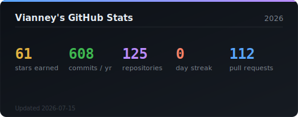
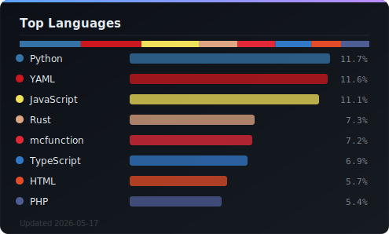

# Hey, I'm Vianney

Software Engineering student at [ETS Montreal](https://www.etsmtl.ca/),
interested in systems programming and cybersecurity.

## Languages

  
  
  
  

## Frameworks & Libraries

  
  
  
  
  
  

## Tools & Databases

  
  
  
  
  
  
  

## GitHub Activity

  
   
  

